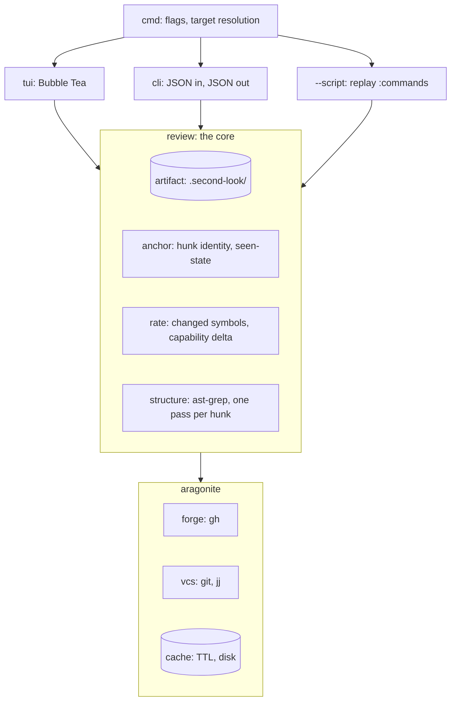

# Design

Screens, keymap, and architecture for second-look. Scope and priorities live in
[requirements.md](requirements.md).

## Overview

Diff-dominant TUI in Bubble Tea, in the same idiom as gh-repo-dashboard: minimal color,
one unified background, borders for hierarchy, vim keybindings, Catppuccin Macchiato.

The diff owns the screen because navigation is by hunk. Everything else summons: the file
tree as an overlay, the context pane as an alternate right half, signature detail as an
on-request popup. The one exception is comments, which stay inline where they anchor and
are capped so they never bury the code.

## Architecture

Three front ends over one core, following gh-repo-dashboard. Only the TUI has an event
loop.



| Package | Responsibility |
| --- | --- |
| `review/artifact` | Read, write, and validate the versioned review JSON |
| `review/anchor` | Hunk identity, seen-state, re-anchoring across a force-push |
| `rate` | Deterministic review-cost rating, from the structural pass |
| `structure` | What a parser sees in a hunk's two sides, through ast-grep |
| `conversations` | The cross-repository conversation queue and what has been read |
| `resolve` | Resolve a thread, or thumbs-up what GitHub gives no resolve |
| `config` | The sections the inbox shows, read from the user's own file |
| `ghrun` | One gh call behind a seam: resolve, react, browse, approve, comment, merge |
| `inbox` | The review searches, and what a triage line shows |
| `prepared` | What is staged under `.second-look/`, in a checkout and in the state directory |
| `stash` | Park uncommitted work so the checkout can move onto a pull request |
| `checkouts` | Which local clones hold a repository, asked of gh-repo-dashboard |
| `aragonite/forge` | Fetch a pull request, post a review atomically |
| `aragonite/vcs` | Diff, branch identity, and working-tree state for git and jj |
| `aragonite/cache` | Everything network-derived and everything expensive to compute |

State lives in one of two places, and every path helper takes a root and appends
`.second-look` so neither is a special case. A pull request of the repository the working
directory belongs to keeps its review, diff cache, thread cache, and read marks in that
checkout, which is where an agent looks. Any other keeps them under the user config
directory, one directory per host, owner, and name, because the queue spans repositories
and a review filed into whichever checkout happened to be open would be lost to every
other one.

The CLI is the agent's interface. `--help` prints every subcommand, the JSON shapes each
accepts and emits, and the errors each raises, so Claude Code can drive the tool with no
other documentation. `-h` prints the short form for a human who forgot a flag.

## Screens

### Inbox

A task list in three buckets, ranked inside each by the cost rating, with stacks shown as
stacks. The buckets are the whole point: what I owe, what I have done that is still live,
and what is finished.

Built as a `tui.List` over the configured searches, with `enter` opening the review, `C`
checking out, `m` commenting, and `A` approving. What the mock below still promises and the
screen does not: the cost rating, the stack, and sorting by anything but what the query
asks for. Opening a row needs no clone of the repository, which is what makes the queue
faster than a browser tab.

```
 second-look                                  12 open · 4 assigned
┌──────────────────────────────────────────────────────────────────┐
│ pending my review                                            4   │
│ ▸ kyleking/jj-diff #42   fix hunk parse errors       7 hunks     │
│     ▓▓▓▓▓▓▓▓░░░░░████░░██  22 mechanical 9 moved 5 logic         │
│   kyleking/tlr #118      add TTL to the pool         3 hunks     │
│     ████                   3 logic  1 signature                  │
│   kyleking/wavez #7      stack 1/3 scheduler leases  4 hunks     │
│   └ #8  stack 2/3 lock contention                   12 hunks     │
│                                                                  │
│ reviewed and open                                            5   │
│   kyleking/calcipy #91   drop the py39 shim    2 unresolved      │
│                                                                  │
│ reviewed and merged                                          3   │
│   kyleking/yak-shears #12  retry the upload     merged 2d ago    │
└──────────────────────────────────────────────────────────────────┘
 [enter]open [/]search [s]ort [tab]bucket [r]efresh [:]cmd [?]help
```

The merged bucket outlives the cached diff. What I said about a change is worth finding
again, so the artifact survives a merge even though the diff it annotated is collected.

gh-repo-dashboard keeps its own inbox and answers a different question. The cache, the
filter and sort engine, and the table live in aragonite, so the two share data and logic
while their screens stay separate.

### Conversations

The queue of open discussions across every pull request I am involved in, bucketed by
whose turn it is. It answers the question neither GitHub nor Linear does: GitHub's
notifications fire on everything and say nothing about who is waiting, and Linear shows
the newest comment rather than the thread it belongs to, so a reply that arrived while I
was away is easy to miss.

```
 second-look conversations                        50 conversations · 13 unread
┌──────────────────────────────────────────────────────────────────────────────┐
│ new since you looked (13)                                                    │
│ ● kyleking/tlr#118      internal/pool/pool.go:42   2h  alice  2 replies       │
│      good catch, pushed a defer                                              │
│ ● kyleking/calcipy#91   review body               13h  bob                    │
│      two questions inline                                                    │
│ waiting on you (2)                                                           │
│ awaiting others (35)                                                         │
│   kyleking/wavez#7      internal/lease/lease.go:9  4d  KyleKing               │
│      no, that one is per worker                                              │
└──────────────────────────────────────────────────────────────────────────────┘
 [enter]read [space]mark read [r]reply [R]resolve [o]GitHub [tab]group [?]help
```

Three surfaces count as a conversation: inline review threads, the pull request's own
comments, and the bodies submitted reviews carry. A conversation is mine when the pull
request is mine, when I have commented in it, or when a comment names me.

Four rules keep the queue short enough to read, and each one was measured against my own
82 open pull requests rather than guessed:

- A machine account reaches the queue only through an inline review thread. That is the
  one surface where what a bot says is anchored to code and can be resolved, whereas its
  pull request comments are coverage tables, linkbacks, and reviewer nudges nobody ever
  resolves. Without this rule the queue held 77 rows and 13 were real
- My own comment with nothing under it is something I said rather than a discussion.
  Nobody owes an answer and I will not thumbs-up myself, so it would be a row that never
  leaves
- A resolved thread is gone, and so is anything I have thumbs-upped. The thumbs-up is my
  marker for dealt-with and it is the only one a pull request comment or a review body can
  carry, so `R` always leaves it and resolves the thread as well when there is one to
  resolve. It goes on the comment that raised the point rather than the last reply
- An outdated thread stays. A reply to it is still owed even though the review screen has
  nowhere to draw it

What I have read is kept per conversation under the user config directory rather than in
a repository, because the queue spans repositories and a mark written into whichever
checkout happened to be open would be lost to every other one. Which bucket a row is in
is fixed while the screen is open: recomputing it after a mark moved the row out from
under the cursor the moment I opened it, which made the screen unusable.

A reply is staged into that pull request's prepared review and posts with it, so `r`
leaves this screen and opens the review screen, which is where a threaded reply already
lives. Writing the answer here would mean a second editor flow and a second copy of the
anchor rules.

Answering means standing on the pull request, and the whole point of the queue is that I
am somewhere else when I read it. So choosing a row off either list moves the checkout
onto it. A dirty tree is the one case that needs me: the question names how many files
are uncommitted and offers to park them with `git stash`, and `git stash pop` brings them
back on whichever branch I choose. Nothing is popped for me, because the work rarely
belongs on the head I just checked out. Declining leaves the tree exactly as it was, so
committing by hand and asking again is the other way through.

The question is only ever asked on a terminal. A piped or `--json` run answers no and
fails with the reason, which keeps an agent from moving a working tree nobody is watching.

A conversation on a repository I am not standing in is the case the queue creates, because
the queue spans repositories and I read it from wherever I happen to be. Finding the clone
is gh-repo-dashboard's job: it already scans the fleet, knows which worktree holds which
branch, and caches it, so second-look runs `gh repo-dashboard --cli` and matches on the
`remote` field rather than growing a second directory scanner. Candidates are ranked by
what using one costs (standing on the branch already, a switch, or the stash question),
one is used without asking, and several are offered in that order. I have more than one
clone of some repositories, which is exactly the case a ranking has to handle rather than
pick for me.

The chosen directory becomes the process's own with one `os.Chdir`, because the prepared
review, the diff cache, the anchor guard, and the shell `!` hands the terminal to all read
`.`. Threading a root through every one of them would eventually miss one and write a
review's state into the wrong repository.

The move is offered rather than automatic: a review that opens where I already stand has
no business touching the tree, so the checkout only moves when standing elsewhere is what
stopped it opening.

### Staged reviews

What is on disk under `.second-look/`, newest first, in two groups: this checkout, then
the reviews staged with no checkout of their repository at all. The artifact is deleted the
moment a review posts, so every row is unfinished work: the review being written, or one
whose head has since moved and which will refuse to post until it is prepared again.

```
 second-look staged reviews                                  5 staged · 1 blocked
┌──────────────────────────────────────────────────────────────────────────────┐
│ staged under .second-look (4)                                                │
│ ● #9                        unreadable  7m   owner, repo, and number are all  │
│   kyleking/second-look#2    ready       7m   1 ready · 1 reply · body @6bc121 │
│   kyleking/second-look#118  ready       17d  3 ready · 2 skipped · body       │
│ ● kyleking/second-look#42   blocked     1y   3 ready · 1 draft · 1 skipped    │
│ staged with no checkout (1)                                                  │
│   acme/platform#904         ready       2h   2 ready · body        @91af0c2   │
└──────────────────────────────────────────────────────────────────────────────┘
 [enter]open [ctrl+r]refresh [?]help
```

The second group is what makes a review with no clone findable again. Both groups open the
same way, from the API, and `C` inside the screen is what gets a working copy when one is
wanted.

A file that no longer parses is listed with its reason rather than skipped, because a
review I cannot read is the row most worth knowing about. `blocked` means a comment is
still a draft, which stops the submit.

Both screens are the same `tui.List`: sections of rows, one cursor, and a set of actions
the caller supplies. They are the same shape, and two screens would drift apart.

### Review

The default screen. Diff fills the frame, comments render inline where they anchor.

```
 kyleking/jj-diff #42          internal/vcs/diff.go     hunk 2/5  ● 3 unseen
┌────────────────────────────────────────────────────────────────────────┐
│ @@ -14,7 +14,9 @@                                                      │
│    func Parse(r io.Reader) ([]Hunk, error) {                           │
│  -     lines := split(r)                                               │
│  +     lines, err := split(r)                                          │
│  +     if err != nil { return nil, err }                               │
│  │ [AI:] split returns a wrapped error here, so callers that            │
│  │ match on io.EOF stop matching. Worth unwrapping?                    │
│  │ ── 2 replies ──                                                     │
│  │ kyleking: good catch, io.EOF is load-bearing in Read                │
│  +     }                                                               │
│                                                                        │
│ @@ -31,4 +33,4 @@                              ▸ moved from util.go:88 │
│  ~     func normalize(s string) string {                               │
└────────────────────────────────────────────────────────────────────────┘
 [n/p]hunk [space]seen [c]omment [-]files [g]raph [s]plit [S]ubmit [?]
```

An unresolved thread caps at three rendered lines: two lines of the comment when it is
alone, or one line of the first, a thread count, and one line of the last when it is not.
The cap exists so a long thread inserts between hunks instead of burying the code.
Resolved threads collapse to nothing in the diff and to a count in the comment view.

### Comment thread

`enter` on a thread opens it. The first comment pins to the top, the reply input sits at
the bottom, and history scrolls up between them, so the two things you always want are
always where you left them.

```
┌─ internal/vcs/diff.go:16 ────────────────────────────── unresolved ─┐
│ [AI:] split returns a wrapped error here, so callers that match on  │
│ io.EOF stop matching. Worth unwrapping?                             │
├─────────────────────────────────────────────────────────────────────┤
│   kyleking: good catch, io.EOF is load-bearing in Read              │
│   author: unwrapping loses the file name though                     │
├─────────────────────────────────────────────────────────────────────┤
│ > errors.Is handles that without unwrapping, see |                  │
│                                    vcs/read.go ← completion         │
└─────────────────────────────────────────────────────────────────────┘
 [ctrl+j/k]scroll [tab]complete [esc]close  ● draft, will not post
```

The reply input takes vim bindings and completes files and symbols. `ctrl+j` and
`ctrl+k` scroll the thread without leaving the input. The input shrinks to one line when
it loses focus. Draft text persists to the artifact immediately and never posts, and a
draft present at submit time blocks the submit rather than silently publishing or
silently dropping it.

### Comment view

Every comment in the review, searchable.

```
 12 comments · 3 unresolved                              /error
┌──────────────────────────────────────────────────────────────────┐
│ internal/vcs/diff.go                              7 resolved     │
│  ● :16  [AI:] split returns a wrapped error here, so callers     │
│         that match on io.EOF stop matching. Worth unwrapping?    │
│         ── 2 more ──                                             │
│         author: unwrapping loses the file name though            │
│                                                                  │
│  ● :88  [TODO:] confirm this path is covered before posting      │
│                                                                  │
│ internal/vcs/git.go                               5 resolved     │
│  ● :204 is the retry bound intentional here?                     │
└──────────────────────────────────────────────────────────────────┘
 [enter]open [/]search [u]nresolved only [esc]back
```

An unresolved entry shows the first comment truncated to two lines, the count in between,
and the last comment in full, which is the inverse of the diff's cap: here the latest
state matters more than the anchor.

### Context pane

Takes the right half, as an alternate to side-by-side rather than alongside it. Shows
where the symbol under the cursor is used, its blast radius, and diagrams derived from
the symbol graph once codeintel is available.

Signature detail is not a pane. It is an on-request popup over the diff, the way an LSP
hover works in vim, because wanting a type is not the same as wanting to navigate.

## Keymap

Layered so the footer stays short.

| Layer | Keys |
| --- | --- |
| Universal | `q` quit, `esc` back, `enter` select, `/` search, `?` help, `:` command |
| Motion | `j`/`k` line, `n`/`p` hunk, `}`/`{` file, `g`/`G` top and bottom |
| Review | `space` seen, `c` comment, `S` submit, `u` unresolved only |
| View | `-` file overlay, `g` context pane, `s` split, `w` whitespace, `t` syntax-aware |
| Thread | `ctrl+j`/`ctrl+k` scroll, `tab` complete, `r` reply, `R` resolve |

`space` marks the hunk under the cursor seen and advances, because marking and moving on
are one motion in practice.

Shelling out follows lazygit: the subprocess owns the terminal, its stdout and stderr are
seen as intended, and the TUI restores on exit. Running the code under review is a first
class action rather than a reason to quit.

## Degradation

- Usable at 80x24. Below that, a resize message
- Usable in 16 colors and under `NO_COLOR`. Seen state, resolved state, and move markers
  all carry a symbol as well as a color, so nothing depends on color alone
- The context pane and side-by-side both collapse below their minimum width, leaving the
  diff, which is the one thing that must always render
