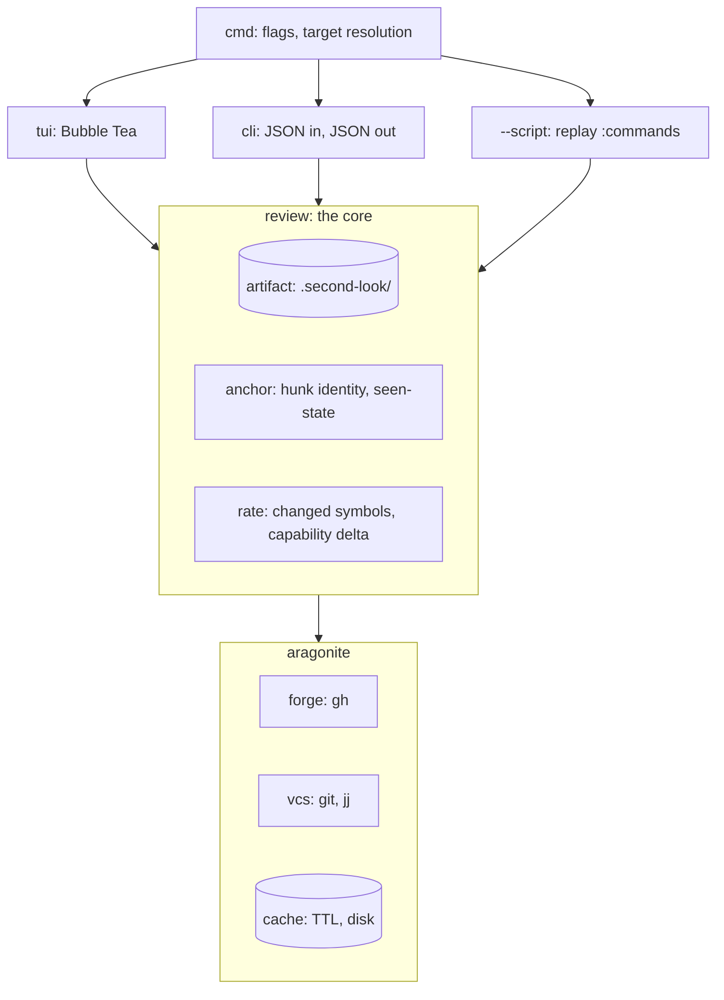

# Design

Screens, keymap, and architecture for second-look. Scope and priorities live in
[requirements.md](requirements.md).

## Overview

Diff-dominant TUI in Bubble Tea, in the same idiom as gh-repo-dashboard: minimal color,
one unified background, borders for hierarchy, vim keybindings, Catppuccin Macchiato.

The diff owns the screen because navigation is by hunk. Everything else summons: the file
tree as an overlay, the context pane as an alternate right half, signature detail as an
on-request popup. The one exception is comments, which stay inline where they anchor and
are capped so they never bury the code.

## Architecture

Three front ends over one core, following gh-repo-dashboard. Only the TUI has an event
loop.



| Package | Responsibility |
| --- | --- |
| `review/artifact` | Read, write, and validate the versioned review JSON |
| `review/anchor` | Hunk identity, seen-state, re-anchoring across a force-push |
| `review/rate` | Deterministic review-cost rating |
| `aragonite/forge` | Fetch a pull request, post a review atomically |
| `aragonite/vcs` | Diff, branch identity, and working-tree state for git and jj |
| `aragonite/cache` | Everything network-derived and everything expensive to compute |

The CLI is the agent's interface. `--help` prints every subcommand, the JSON shapes each
accepts and emits, and the errors each raises, so Claude Code can drive the tool with no
other documentation. `-h` prints the short form for a human who forgot a flag.

## Screens

### Inbox

A task list in three buckets, ranked inside each by the cost rating, with stacks shown as
stacks. The buckets are the whole point: what I owe, what I have done that is still live,
and what is finished.

```
 second-look                                  12 open · 4 assigned
┌──────────────────────────────────────────────────────────────────┐
│ pending my review                                            4   │
│ ▸ kyleking/jj-diff #42   fix hunk parse errors       7 hunks     │
│     ▓▓▓▓▓▓▓▓░░░░░████░░██  22 mechanical 9 moved 5 logic         │
│   kyleking/tlr #118      add TTL to the pool         3 hunks     │
│     ████                   3 logic  1 signature                  │
│   kyleking/wavez #7      stack 1/3 scheduler leases  4 hunks     │
│   └ #8  stack 2/3 lock contention                   12 hunks     │
│                                                                  │
│ reviewed and open                                            5   │
│   kyleking/calcipy #91   drop the py39 shim    2 unresolved      │
│                                                                  │
│ reviewed and merged                                          3   │
│   kyleking/yak-shears #12  retry the upload     merged 2d ago    │
└──────────────────────────────────────────────────────────────────┘
 [enter]open [/]search [s]ort [tab]bucket [r]efresh [:]cmd [?]help
```

The merged bucket outlives the cached diff. What I said about a change is worth finding
again, so the artifact survives a merge even though the diff it annotated is collected.

gh-repo-dashboard keeps its own inbox and answers a different question. The cache, the
filter and sort engine, and the table live in aragonite, so the two share data and logic
while their screens stay separate.

### Review

The default screen. Diff fills the frame, comments render inline where they anchor.

```
 kyleking/jj-diff #42          internal/vcs/diff.go     hunk 2/5  ● 3 unseen
┌────────────────────────────────────────────────────────────────────────┐
│ @@ -14,7 +14,9 @@                                                      │
│    func Parse(r io.Reader) ([]Hunk, error) {                           │
│  -     lines := split(r)                                               │
│  +     lines, err := split(r)                                          │
│  +     if err != nil { return nil, err }                               │
│  │ [AI:] split returns a wrapped error here, so callers that            │
│  │ match on io.EOF stop matching. Worth unwrapping?                    │
│  │ ── 2 replies ──                                                     │
│  │ kyleking: good catch, io.EOF is load-bearing in Read                │
│  +     }                                                               │
│                                                                        │
│ @@ -31,4 +33,4 @@                              ▸ moved from util.go:88 │
│  ~     func normalize(s string) string {                               │
└────────────────────────────────────────────────────────────────────────┘
 [n/p]hunk [space]seen [c]omment [-]files [g]raph [s]plit [S]ubmit [?]
```

An unresolved thread caps at three rendered lines: two lines of the comment when it is
alone, or one line of the first, a thread count, and one line of the last when it is not.
The cap exists so a long thread inserts between hunks instead of burying the code.
Resolved threads collapse to nothing in the diff and to a count in the comment view.

### Comment thread

`enter` on a thread opens it. The first comment pins to the top, the reply input sits at
the bottom, and history scrolls up between them, so the two things you always want are
always where you left them.

```
┌─ internal/vcs/diff.go:16 ────────────────────────────── unresolved ─┐
│ [AI:] split returns a wrapped error here, so callers that match on  │
│ io.EOF stop matching. Worth unwrapping?                             │
├─────────────────────────────────────────────────────────────────────┤
│   kyleking: good catch, io.EOF is load-bearing in Read              │
│   author: unwrapping loses the file name though                     │
├─────────────────────────────────────────────────────────────────────┤
│ > errors.Is handles that without unwrapping, see |                  │
│                                    vcs/read.go ← completion         │
└─────────────────────────────────────────────────────────────────────┘
 [ctrl+j/k]scroll [tab]complete [esc]close  ● draft, will not post
```

The reply input takes vim bindings and completes files and symbols. `ctrl+j` and
`ctrl+k` scroll the thread without leaving the input. The input shrinks to one line when
it loses focus. Draft text persists to the artifact immediately and never posts, and a
draft present at submit time blocks the submit rather than silently publishing or
silently dropping it.

### Comment view

Every comment in the review, searchable.

```
 12 comments · 3 unresolved                              /error
┌──────────────────────────────────────────────────────────────────┐
│ internal/vcs/diff.go                              7 resolved     │
│  ● :16  [AI:] split returns a wrapped error here, so callers     │
│         that match on io.EOF stop matching. Worth unwrapping?    │
│         ── 2 more ──                                             │
│         author: unwrapping loses the file name though            │
│                                                                  │
│  ● :88  [TODO:] confirm this path is covered before posting      │
│                                                                  │
│ internal/vcs/git.go                               5 resolved     │
│  ● :204 is the retry bound intentional here?                     │
└──────────────────────────────────────────────────────────────────┘
 [enter]open [/]search [u]nresolved only [esc]back
```

An unresolved entry shows the first comment truncated to two lines, the count in between,
and the last comment in full, which is the inverse of the diff's cap: here the latest
state matters more than the anchor.

### Context pane

Takes the right half, as an alternate to side-by-side rather than alongside it. Shows
where the symbol under the cursor is used, its blast radius, and diagrams derived from
the symbol graph once codeintel is available.

Signature detail is not a pane. It is an on-request popup over the diff, the way an LSP
hover works in vim, because wanting a type is not the same as wanting to navigate.

## Keymap

Layered so the footer stays short.

| Layer | Keys |
| --- | --- |
| Universal | `q` quit, `esc` back, `enter` select, `/` search, `?` help, `:` command |
| Motion | `j`/`k` line, `n`/`p` hunk, `}`/`{` file, `g`/`G` top and bottom |
| Review | `space` seen, `c` comment, `S` submit, `u` unresolved only |
| View | `-` file overlay, `g` context pane, `s` split, `w` whitespace, `t` syntax-aware |
| Thread | `ctrl+j`/`ctrl+k` scroll, `tab` complete, `r` reply, `R` resolve |

`space` marks the hunk under the cursor seen and advances, because marking and moving on
are one motion in practice.

Shelling out follows lazygit: the subprocess owns the terminal, its stdout and stderr are
seen as intended, and the TUI restores on exit. Running the code under review is a first
class action rather than a reason to quit.

## Degradation

- Usable at 80x24. Below that, a resize message
- Usable in 16 colors and under `NO_COLOR`. Seen state, resolved state, and move markers
  all carry a symbol as well as a color, so nothing depends on color alone
- The context pane and side-by-side both collapse below their minimum width, leaving the
  diff, which is the one thing that must always render
